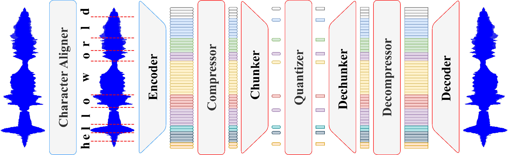

# 🔀 DyCAST


A variable-frame-rate 16 kHz speech codec based on [FocalCodec](https://arxiv.org/abs/2502.04465).

- 📜 **Papers**:

    - [Beyond Fixed Frames: Dynamic Character-Aligned Speech Tokenization](https://arxiv.org/abs/2601.23174)

    - [FocalCodec-Stream: Streaming Low-Bitrate Speech Coding via Causal Distillation](https://arxiv.org/abs/2509.16195)

    - [FocalCodec: Low-Bitrate Speech Coding via Focal Modulation Networks](https://arxiv.org/abs/2502.04465)

- 🔊 **Downstream Tasks**: https://github.com/lucadellalib/audiocodecs



---------------------------------------------------------------------------------------------------------

## 📌 Available Checkpoints

|                            Checkpoint                             | Sample Rate (kHz) | Frame Rate (Hz) | Codebooks  | Bitrate (kbps) |   Dataset    |
|:-----------------------------------------------------------------:|:-----------------:|:---------------:|:----------:|:--------------:|:------------:|
| [lucadellalib/dycast](https://huggingface.co/lucadellalib/dycast) |        16         |   6.2 - 17.5    | 1 x (4^32) |  0.40 - 1.12   | LibriTTS-960 |

--------------------------------------------------------------------------------------------------------

## 🛠️️ Installation

First of all, install [Python 3.8 or later](https://www.python.org). Then, open a terminal and run:

```
pip install faiss-cpu huggingface-hub numpy safetensors soundfile torch torchaudio torchcodec transformers
```

---------------------------------------------------------------------------------------------------------

## ▶️ Quickstart

**NOTE**: the `audios` directory contains audio samples that you can download and use to test the codec.

You can easily load the model using `torch.hub` without cloning the repository:

```python
import torch
import torchaudio

# Load DyCAST model
codec = torch.hub.load(
    repo_or_dir="lucadellalib/dycast",
    model="dycast",
    config="lucadellalib/dycast",
    force_reload=True,  # Fetch the latest version from Torch Hub
)
codec.eval().requires_grad_(False)

# Load and preprocess the input audio
audio_file = "audios/librispeech-dev-clean/251-118436-0003.wav"
sig, sample_rate = torchaudio.load(audio_file)
sig = torchaudio.functional.resample(sig, sample_rate, codec.sample_rate_input)

# Forward
toks, pcodes, rec_sig = codec(sig)
print("Tokens:")
print(toks.shape)
print(toks)

print("Pooled codes:")
print(pcodes.shape)
print(pcodes)

# Save the reconstructed audio
rec_sig = torchaudio.functional.resample(rec_sig, codec.sample_rate_output, sample_rate)
torchaudio.save("reconstruction.wav", rec_sig, sample_rate)
```

Alternatively, you can install DyCAST as a standard Python package using `pip`:

```bash
pip install dycast@git+https://github.com/lucadellalib/dycast.git@main#egg=dycast
```

Once installed, you can import it in your scripts:

```python
import dycast

config = "lucadellalib/dycast"
codec = dycast.DyCAST.from_pretrained(config)
```

Check the code documentation for more details on model usage and available configurations.

---------------------------------------------------------------------------------------------------------

## 🎤 Running the Demo

Clone or download and extract the repository, navigate to `<path-to-repository>`, open a terminal and run:

```bash
python dycast/codec.py audios/librispeech-dev-clean/251-118436-0003.wav
```

Reconstructed audio samples using different inference modes can be found in the `reconstructions` directory.

---------------------------------------------------------------------------------------------------------

## @ Citing

```bibtex
@article{dellalibera2026dycast,
    title   = {Beyond Fixed Frames: Dynamic Character-Aligned Speech Tokenization},
    author  = {Luca {Della Libera} and Cem Subakan and Mirco Ravanelli},
    journal = {arXiv preprint arXiv:2601.23174},
    year    = {2026},
}
```

```bibtex
@article{dellalibera2025focalcodecstream,
    title   = {{FocalCodec-Stream}: Streaming Low-Bitrate Speech Coding via Causal Distillation},
    author  = {Luca {Della Libera} and Cem Subakan and Mirco Ravanelli},
    journal = {arXiv preprint arXiv:2509.16195},
    year    = {2025},
}
```

```bibtex
@inproceedings{dellalibera2025focalcodec,
    title     = {{FocalCodec}: Low-Bitrate Speech Coding via Focal Modulation Networks},
    author    = {Luca {Della Libera} and Francesco Paissan and Cem Subakan and Mirco Ravanelli},
    booktitle = {Advances in Neural Information Processing Systems},
    year      = {2025},
}
```

---------------------------------------------------------------------------------------------------------

## 📧 Contact

[luca.dellalib@gmail.com](mailto:luca.dellalib@gmail.com)

---------------------------------------------------------------------------------------------------------
